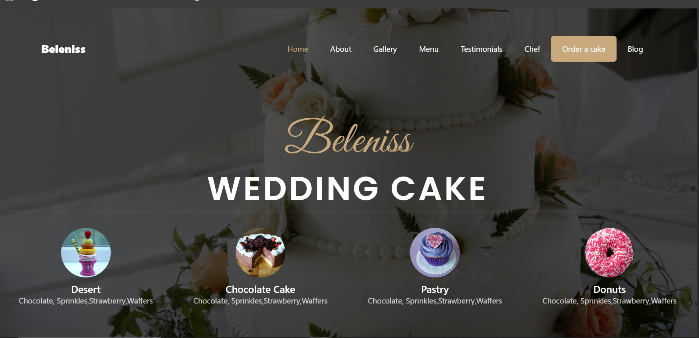

🍰 Cake-Website
A delicious and visually appealing static cake shop website built using HTML, CSS, and JavaScript — showcasing a simple UI for browsing cakes with animated effects and responsive interaction.

📌 About the Project
This project is a front-end implementation of a cake shop website where users can view a variety of cake designs and interact with the UI. It demonstrates modern web design principles with clean layout and responsive functionality.

✨ Technologies used:
HTML
CSS
JavaScript

🛠️ Folder structure:
css/  
images/  
js/  
index.html  
style.css  
main.js  

🚀 Features
✔️ Homepage with cake showcase
✔️ Responsive design for different screen sizes
✔️ Smooth animations and interactive UI
✔️ Clear folder structure for assets

📁 Getting Started
To run this project locally:
Clone the repository
git clone https://github.com/sarthak291/Cake-Website.git
Open the project folder
cd Cake-Website
Open index.html
Double-click it or open it in your preferred browser.

📸 Screenshots

